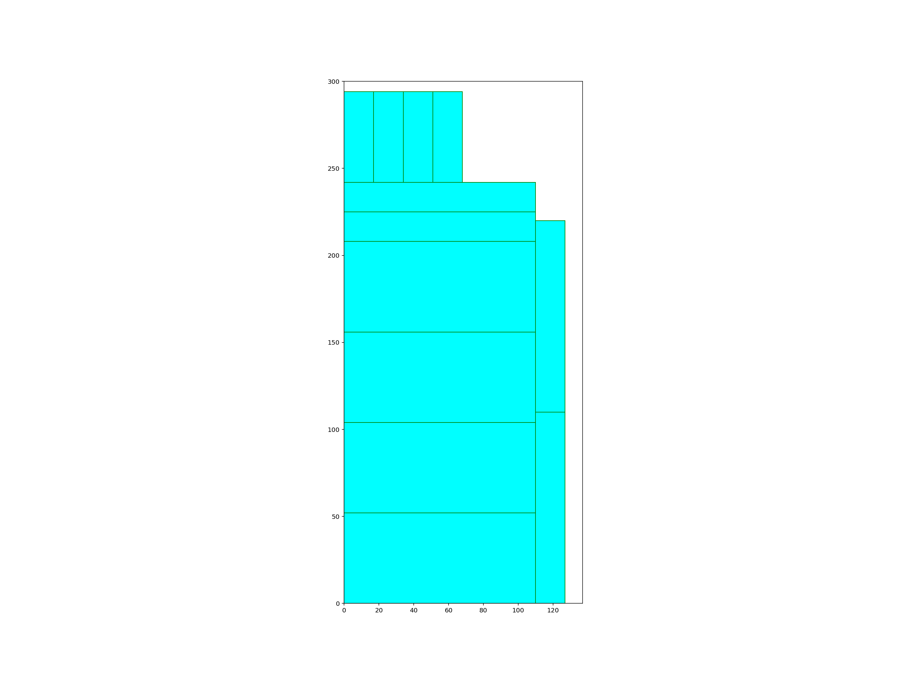

# Rectangle Packing
Solving the Rectangle Packing Problem in Python

Given dimensions of a 2D box, and dimensions of a 3D box to be cut out of the main box, and the amount of the 3D boxes, the program fits all the rectangles into the big one and display it in the form of a SVG so you can use it efficiently

### Application can be found running here: https://share.streamlit.io/alizahidraja/rectangle-packing/main/source.py

## Example:
Red Box Width: 137

Red Box Height: 300

Green Box Width: 52

Green Box Height: 110

Green Box Depth: 17

Amount: 2

Result:

